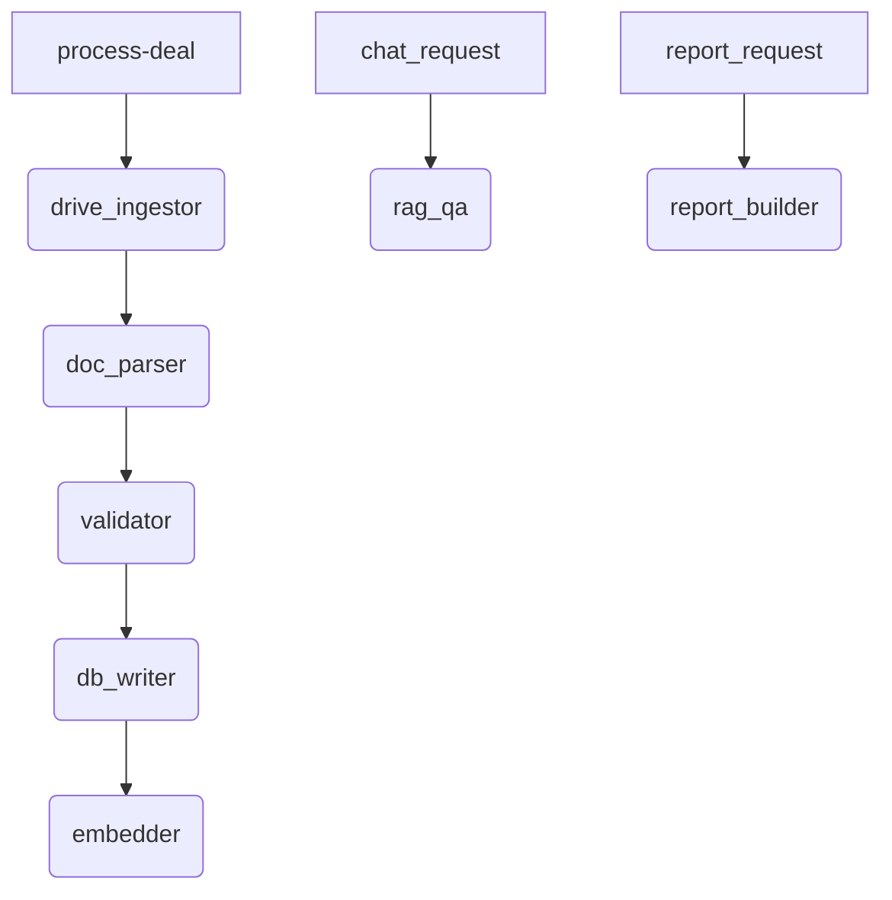

# Deal‑AI — Agents Specification

This file formalises the autonomous/LLM “agents” that the Deal‑AI stack will expose once we switch to a Codex‑style multi‑agent runner.

> **Why this file?**  Codex and similar orchestrators expect an `agents.md` inventory so they can bootstrap tool‑use policies, call‑routes, and permissions without scraping ad‑hoc comments from source code.

---

## 1  Glossary

| Term           | Meaning                                                                               |
| -------------- | ------------------------------------------------------------------------------------- |
| **Tool**       | An executable capability (e.g. “Google Drive Search”, “Chroma Query”, “Jinja Render”) |
| **Agent**      | A named persona/policy that can invoke one or more tools to fulfil a sub‑task         |
| **Controller** | Top‑level router (provided by Codex) that maps user intent → agent chain              |

---

## 2  Current Agents (MVP)

| Name                | Description / Role                                                                      | Tools authorised                                                         | Triggers                         |
| ------------------- | --------------------------------------------------------------------------------------- | ------------------------------------------------------------------------ | -------------------------------- |
| **drive\_ingestor** | Lists files in a Google Drive folder, downloads bytes.                                  | `drive.list`, `drive.download`                                           | `process-deal` HTTP POST         |
| **doc\_parser**     | Converts raw bytes → `ParsedDocument` objects (PDF → text, XLSX → tables, DOCX → text). | `unstructured.parse_pdf`, `pandas.read_excel`, `unstructured.parse_docx` | downstream from `drive_ingestor` |
| **validator**       | Runs Pydantic validation and Great Expectations checks (TBD) on parsed data.            | `pydantic.validate`, `great_expectations.check`                          | after `doc_parser`               |
| **db\_writer**      | Persists deal JSON to Postgres.                                                         | `postgres.insert_jsonb`                                                  | after `validator`                |
| **embedder**        | Splits text, calls OpenAI embeddings, upserts to Chroma.                                | `openai.embed`, `chroma.upsert`                                          | after `db_writer`                |
| **rag\_qa**         | Retrieves top‑k chunks from Chroma and calls Chat Completion.                           | `chroma.query`, `openai.chat`                                            | `/chat` endpoint                 |
| **report\_builder** | Loads deal JSON, renders lender‑overview via Jinja template.                            | `jinja.render`, `postgres.select_jsonb`                                  | `/report/{deal_id}` endpoint     |

> **Note** – At MVP we run all agents sequentially inside one FastAPI worker; Codex upgrade will allow parallel/task‑queue execution.

---

## 3  Tool Catalogue

### 3.1  drive.list

```yaml
input : {folder_id: str}
output: List[ {id:str, name:str, mimeType:str} ]
```

Lists non‑trashed, non‑archived files in a Google Drive folder.

### 3.2  drive.download

```yaml
input : {file_id: str}
output: bytes  # raw file contents
```

### 3.3  unstructured.parse\_pdf

Converts PDF bytes → plain text using Unstructured partitioner.

### 3.4  pandas.read\_excel

Reads XLSX → DataFrame list.

### 3.5  unstructured.parse\_docx

Reads DOCX/DOCM → plain text.

### 3.6  pydantic.validate

Uses `schemas.ParsedDocument` to raise on missing fields.

### 3.7  postgres.insert\_jsonb / select\_jsonb

Simple SQLAlchemy helpers.

### 3.8  openai.embed

`model: text-embedding-ada-002`, returns 1536‑d vector.

### 3.9  chroma.upsert / query

HTTP insert + nearest‑neighbour search.

### 3.10  openai.chat

`model: gpt-3.5-turbo` (default) – deterministic (`temperature=0`).

### 3.11  jinja.render

Renders `backend/templates/overview.md.jinja` with deal context.

---

## 4  Routing Logic (Codex pseudocode)



---

## 5  Permissions Matrix

| Agent → Tool        | list | download | parse | validate | db | embed | query | render |
| ------------------- | ---- | -------- | ----- | -------- | -- | ----- | ----- | ------ |
| **drive\_ingestor** | ✔    | ✔        | –     | –        | –  | –     | –     | –      |
| **doc\_parser**     | –    | –        | ✔     | –        | –  | –     | –     | –      |
| **validator**       | –    | –        | –     | ✔        | –  | –     | –     | –      |
| **db\_writer**      | –    | –        | –     | –        | ✔  | –     | –     | –      |
| **embedder**        | –    | –        | –     | –        | –  | ✔     | –     | –      |
| **rag\_qa**         | –    | –        | –     | –        | –  | –     | ✔     | –      |
| **report\_builder** | –    | –        | –     | –        | ✔  | –     | –     | ✔      |

---

## 6  Future Agents (post‑MVP)

* **excel\_cashflow\_agent** – classify and normalise cash‑flow tables.
* **term\_sheet\_agent** – draft term‑sheet JSON → legal markup.
* **anomaly\_detector** – compare new deal metrics vs historical DB.

---

## 7  How to Extend

1. Define a new tool in this file.
2. Add a Python function in `backend/tools/`.
3. Add an agent entry with authorised tools.
4. Update routing in `controllers.py` once Codex orchestrator is integrated.

---

> *Generated 4 Jun 2025 via ChatGPT.*
